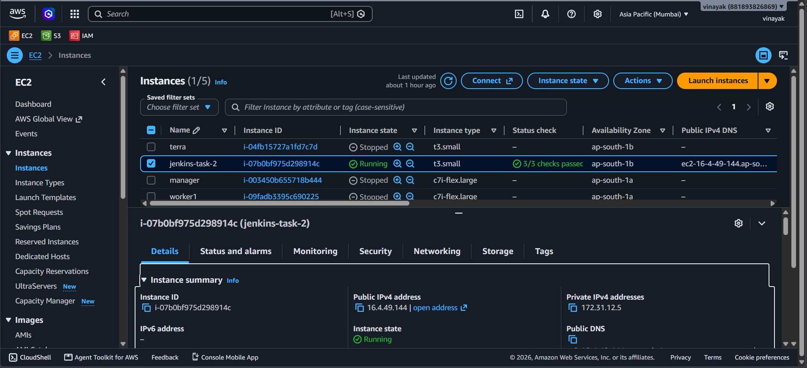
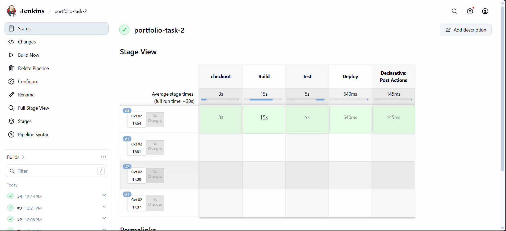
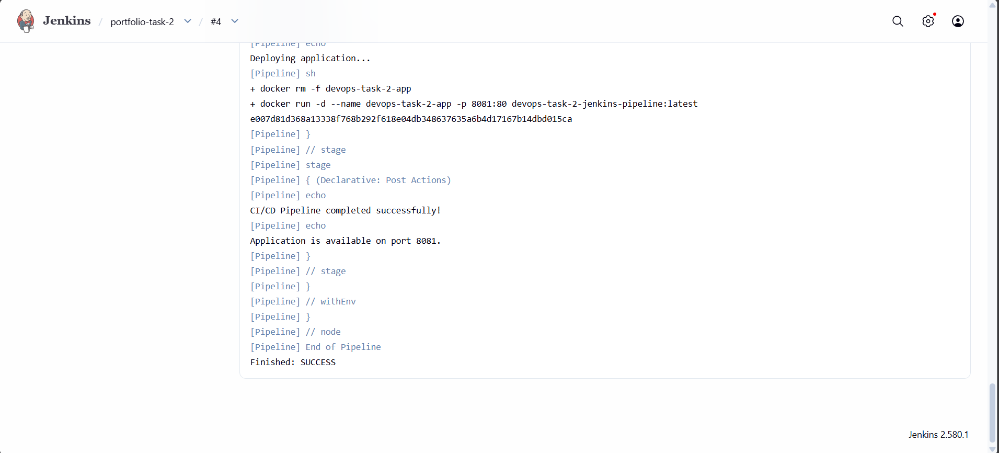
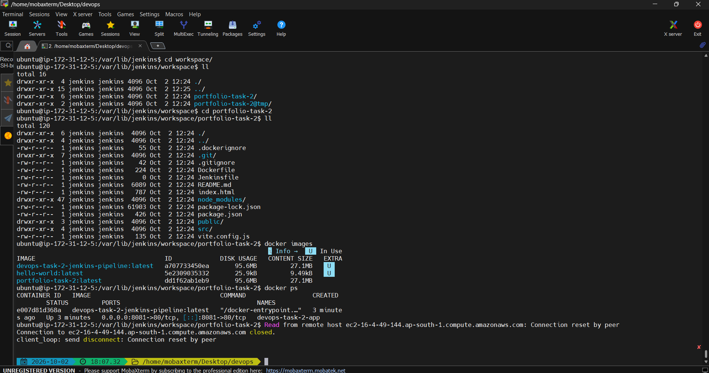
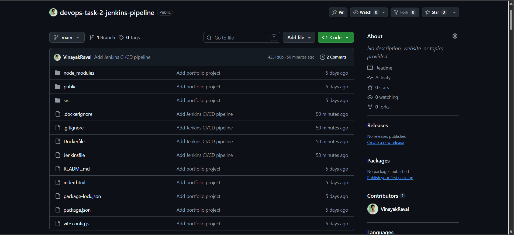

# DevOps Task 2 — Jenkins CI/CD Pipeline with Docker

## Project Overview

This project implements a simple CI/CD pipeline for a React/Vite portfolio application using **GitHub, Jenkins, Docker, and AWS EC2**.

The pipeline:
1. Checks out source code from GitHub.
2. Builds the application as a Docker image.
3. Tests the Dockerized application.
4. Deploys the application as a Docker container on AWS EC2.

## Task Objective

**DevOps Internship — Task 2: Create a Simple Jenkins Pipeline for CI/CD**

The task requires Jenkins and Docker, a Jenkinsfile, Build/Test/Deploy stages, a commit-triggered pipeline, and a GitHub submission.

## Technology Stack

| Technology | Purpose |
|---|---|
| AWS EC2 | Cloud server / deployment environment |
| Ubuntu | EC2 operating system |
| Jenkins | CI/CD automation |
| Docker | Application containerization |
| Git | Version control |
| GitHub | Source-code repository |
| React + Vite | Portfolio application |
| Nginx | Production web server |

## CI/CD Architecture

```text
Developer
   |
   | git push
   v
GitHub
   |
   v
Jenkins on AWS EC2
   |
   +--> Checkout
   |
   +--> Build
   |      |
   |      +--> Docker image
   |
   +--> Test
   |      |
   |      +--> Temporary container
   |
   +--> Deploy
          |
          +--> Docker container :8081
                    |
                    v
              Portfolio Website
```

## Project Structure

```text
devops-task-2-jenkins-pipeline/
├── public/
├── src/
├── .dockerignore
├── .gitignore
├── Dockerfile
├── Jenkinsfile
├── README.md
├── index.html
├── package.json
├── package-lock.json
└── vite.config.js
```

## Dockerfile

The Dockerfile uses a multi-stage build:

```text
Node.js
   |
npm ci
   |
npm run build
   |
dist/
   |
Nginx Alpine
   |
Production container
```

The application is served on container port `80`.

## Jenkins Pipeline

### Checkout
Jenkins retrieves the latest source code from GitHub.

### Build
Builds the Docker image:

```bash
docker build -t devops-task-2-jenkins-pipeline:latest .
```

### Test
Starts a temporary container on port `8082` and verifies the application:

```bash
curl -f http://localhost:8082
```

### Deploy
Replaces the old container and starts the new version:

```bash
docker rm -f devops-task-2-app || true

docker run -d   --name devops-task-2-app   -p 8081:80   devops-task-2-jenkins-pipeline:latest
```

The deployed application is available at:

```text
http://EC2_PUBLIC_IP:8081
```

## Jenkins Configuration

This implementation can use:

```text
Definition: Pipeline script
```

The pipeline script can be pasted directly into the Jenkins Pipeline job.

The repository also contains `Jenkinsfile` as the pipeline-file deliverable.

## AWS EC2 Setup

The EC2 server should have:

```text
Ubuntu
Java 21
Jenkins
Docker
Git
```

Useful checks:

```bash
java -version
docker --version
git --version
sudo systemctl status jenkins
sudo -u jenkins docker ps
```

## Automatic Trigger

Configure Jenkins:

```text
Job
 -> Configure
 -> Build Triggers
 -> Poll SCM
```

Example schedule:

```text
H/5 * * * *
```

After a GitHub commit is detected, Jenkins starts a new build.

## Local Testing

Install dependencies:

```bash
npm install
```

Build:

```bash
npm run build
```

Run with Docker:

```bash
docker build -t devops-task-2-jenkins-pipeline .
docker run -d --name devops-task-2-app -p 8081:80 devops-task-2-jenkins-pipeline
```

Open:

```text
http://localhost:8081
```

## Evidence / Screenshots

Place the real screenshots in the `screenshots/` directory.

### AWS EC2



Show the running EC2 instance.

### Jenkins Pipeline



Show successful Checkout/Build/Test/Deploy stages.

### Jenkins Console



Show the successful console output, including `Finished: SUCCESS`.

### Docker Container



Show:

```bash
docker ps
```

with the deployed application container.

### Deployed Portfolio


Show the portfolio at:

```text
http://EC2_PUBLIC_IP:8081
```

### GitHub Repository



Show the GitHub repository containing the project files.

### Automatic Trigger


Show a Jenkins build created after a GitHub commit.

> **Important:** The image files included in this package are placeholders. Replace them with your own actual screenshots. Do not submit placeholder images as evidence.

## Testing Checklist

- [ ] EC2 instance running
- [ ] Jenkins running
- [ ] Docker running
- [ ] Jenkins can execute Docker
- [ ] GitHub repository configured
- [ ] Checkout succeeds
- [ ] Build succeeds
- [ ] Test succeeds
- [ ] Deploy succeeds
- [ ] Portfolio accessible on port 8081
- [ ] Commit triggers a new Jenkins build
- [ ] Real screenshots added
- [ ] README updated
- [ ] GitHub repository link ready for submission

## Interview Questions

### 1. What is Jenkins and how is it used in CI/CD?
Jenkins is an automation server used to automate software build, testing, and deployment tasks.

### 2. What is a Jenkinsfile?
A Jenkinsfile is a text file that defines a Jenkins Pipeline as code.

### 3. How do you create and configure Jenkins pipelines?
Create a Pipeline job, configure the source repository or pipeline script, define the stages, and configure a suitable trigger.

### 4. What are common Jenkins pipeline stages?
Common stages include:

```text
Checkout
Build
Test
Deploy
```

### 5. Declarative vs Scripted Jenkins Pipeline
A Declarative Pipeline uses a structured `pipeline {}` syntax for common CI/CD workflows. A Scripted Pipeline uses Groovy-based scripting and offers more programming flexibility.

## Result

The project demonstrates a CI/CD workflow where GitHub stores the source code, Jenkins automates the pipeline, Docker packages the application, and AWS EC2 hosts the Jenkins/Docker deployment environment.

## Submission

GitHub Repository:

```text
PASTE-YOUR-GITHUB-REPOSITORY-LINK-HERE
```

Application:

```text
http://EC2_PUBLIC_IP:8081
```

Jenkins:

```text
http://EC2_PUBLIC_IP:8080
```
